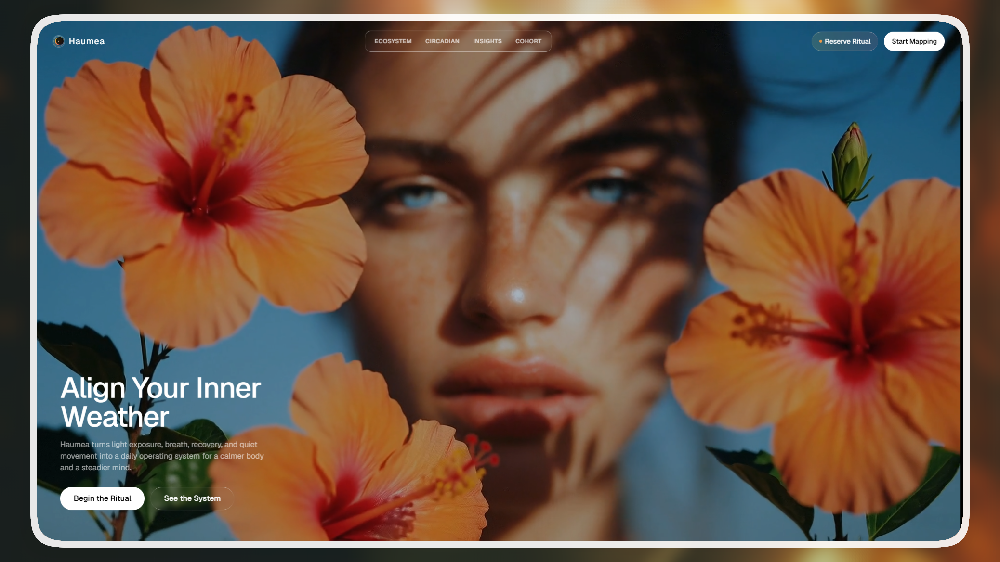

# 🌿 Haumea — Somatic Renewal & Circadian Intelligence Landing Page

> **Day 17/30 of the "Building 1 AI-Generated Landing Page Every Day" Challenge**



## 🚀 About

Conceptual landing page for **Haumea**, a premium **somatic renewal and circadian intelligence platform** designed to align your body's biology with the natural rhythms of creation. Developed with **Vite**, **React 19**, **TypeScript**, and **Tailwind CSS v3**. This project is the seventeenth realization of our ambitious challenge: creating **1 complete and functional mockup per day using AI**.

Haumea is designed to dissolve chronic stress, restore natural circadian pathways, and nurture somatic growth through structured rituals, quiet-rest integration, and deep, non-invasive bio-marker tracking. The experience is delivered via a refined, image-led, luxury dark-themed interface built on glassmorphic compositions.

Live URL: [https://haumea-landing.adrielzimbril.com](https://haumea-landing.adrielzimbril.com)

## 🎨 Design & Aesthetic Decisions

For this project, the theme focuses on **somatic biology, organic balance, and circadian alignment**.

- **Luxury Organic Warmth:** A refined palette of deep obsidian ink, warm cream, burnished copper, and soft gold accents, coupled with dynamic atmospheric background video looping.
- **Micro-interactions:** A stateful and immersive Interactive Daily Routine Builder that lets users inspect morning rise, mid-day focus, and evening wind-down habits.
- **Glassmorphism (Liquid Glass):** Sophisticated frosted glass components blending seamlessly with the moving background elements.
- **Premium Typography:** Clean Sans-serif modern typography designed for high-end digital wellness interfaces.

## 🧩 Key Sections

- **🌟 Hero Section:** Immersive introduction with a fluid ambient background video loop, luxury branding, sticky glass navigation, and performance CTA buttons.
- **🌿 Wellness Ecosystem:** Four-part core somatic domains covering Mind Dynamics, Physical Synergy, Structured Routine, and Tailored Growth.
- **🔄 Daily Routine Builder:** Stateful interactive timeline dashboard showing hourly habits (Morning Rise, Mid-day Focus, and Evening Wind-down rituals).
- **📊 Deep Insights:** Somatic analytics visualization and detailed biological marker summaries.
- **🧬 Expert Cohort:** Co-designed by leading specialists in somatic health, circadian medicine, and neural sciences.
- **🌐 Footer:** Brand summary, "Circadian Stream" newsletter signup, and somatic legal links.

## 🛠️ Tech Stack

This mockup was built with modern, high-performance web technologies:

- **[Vite](https://vite.dev/)** as the ultra-fast build tool
- **[React 19](https://react.dev/)**
- **TypeScript** for scalable component architecture
- **[Tailwind CSS v3](https://tailwindcss.com/)** for modern design tokens and utility styling
- **[Lucide React](https://lucide.dev/)** for clean, modern iconography

## 🚀 Quick Start

```bash
# Install dependencies
pnpm install

# Run development server
pnpm dev
```

Open `http://localhost:5173` in your browser to see the result.

## 🌌 Let's meet in space (or on Earth) 🚀

I'm always happy to discuss new projects, collaborations, or simply exchange creative ideas. Here's how to contact me:

- **📧 Email**: [hello@adrielzimbril.com](mailto:hello@adrielzimbril.com)
- **🌐 Website**: [https://www.adrielzimbril.com](https://www.adrielzimbril.com)
- **🐦 Twitter**: [https://twitter.com/adrielzimbril](https://twitter.com/adrielzimbril)
- **💼 LinkedIn**: [https://www.linkedin.com/in/adrielzimbrilcode](https://www.linkedin.com/in/adrielzimbrilcode)
- **🐼 GitHub**: [https://github.com/adrielzimbril](https://github.com/adrielzimbril)

### 🐼 Fun Facts

- 🚀 Passionate about space exploration and technology
- 🐼 Love pandas (and animals in general!)
- 🎨 Creative at heart, whether in design or code
- ☕ Addicted to coffee and complex technical challenges

## 🌟 Join the Adventure

If you like this project, feel free to:

- ⭐ Star the project
- 🐞 Report bugs
- ✨ Suggest improvements
- 🚀 Share with other enthusiasts

## 💖 Support the Project

If you find this project useful and would like to support its development, you can do so through these platforms:

[](https://go.adrielzimbril.com/gs)

## 🌐 Hosting

This project is 100% hosted on modern cloud infrastructure for maximum performance and reliability:

[](https://vercel.com)

## 📄 License

This project is under the MIT license. Feel free to use it as a base for your own portfolio or project.

---

**Developed with ❤️ by Adriel Zimbril**
_Product Designer & Fullstack Developer_
🚀 Digital Universe Explorer | 🐼 Panda Friend | 🎨 Passionate Creator
